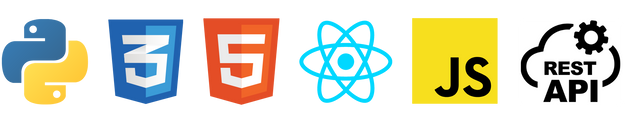

# Welcome to Kristy's GitHub!
🔊 [Introduction spoken by Kristy](https://www.dropbox.com/s/4wc3jeblu89qspr/intro_to_kristy_126sec.mp3?dl=0)  🔗 [Linktr.ee](https://linktr.ee/kristyleigh)

I'm Junior Developer and She Codes Plus 22/23 student, ready to commence my first role in tech.

In July 2022, I decided to focus full-time on building the skills and knowledge to become a developer and break into the tech industry. I also proceeded to explore my strong interest in AI & ML. 

I have since joined the She Codes Plus program, built a portfolio demonstrating my knowledge as a developer, contributed to open-source/community projects and attended numerous workshops, conferences and networking events. 

I'm passionate about continuous self-learning and actively participate in online learning for programming and AI.

 

**Skip to:** 🚀 [Projects & Challenges](#-projects--challenges) ⚡ [Microsoft Certifications](#-microsoft-certifications) 

-----
## 💻 Tech Stack:

-----

## 🧁 She Codes Plus Program:

I am currently participating in the [She Codes Plus](https://shecodes.com.au/program/plus/) Program learning: `HTML`, `CSS`, `Python`, `Django`, `Django REST Framework`, `JavaScript` & `ReactJS` and will complete my training in April 2023. This program is a competitive, respected and influential bootcamp that prepares participants for a career in the tech industry. 

-----
## 🚀 Projects & Challenges:

### She Codes Plus Projects:

| - | Tech | Title | Code |
| :-- | :-- | :-- | :-- | 
|✅ | `HTML` `CSS` | [Portfolio Website](https://ms-kl.github.io/) | [Repo](https://github.com/Ms-KL/Ms-KL.github.io) |
|✅ | `Python` | Weather Data Processing | [Repo](https://github.com/Ms-KL/she-codes-python-weather-project-Ms-KL) |
|✅ | `Django` |  [News Website](https://www.loom.com/share/fa6a7813a17f41b69c7a54d8ddf87a7a)| [Repo](https://github.com/Ms-KL/she-codes-django-news-project-Ms-KL) |
|✅ | `Django REST Framework` | [Deployed Crowdfunding App (back-end)](https://icy-dew-540.fly.dev/) | [Repo](https://github.com/Ms-KL/she-codes-crowdfunding-api-project-Ms-KL) | 
|⏳ | `React.JS` | To-Do list app | [Repo](https://github.com/Ms-KL/todo-list) |
|⏳ | `React.JS` | Deployed Crowdfunding App (front-end) | (tba) |
|⏳ | (tba)| She Codes Plus Final Group Project | (tba) |

  

### Personal, Community & Open-Source Projects

| - | Tech | Title | Code |
| :--- | :--- | :--- | :--- |
|⏳ | `Azure Cognitive Services` | "About Kristy" Chatbot (personal) | (tba) |
|⏳ | `DRF` `REACT.JS` | "Sulphite Safe" App (personal) | (tba)
|⏳ | `Python` | `numpy-financial` test coverage + docs contribution (open-source) | (tba) |

 

-----

## ⚡ Microsoft Certifications:
- ✅ [Microsoft
Azure AI Fundamentals](https://www.credly.com/badges/cf1a19d2-5f6e-49d2-9524-5eb88053f091/public_url)
- ⏳ Microsoft Azure AI Engineer Associate

 

## 🎓 Tech/Data Post-Grad Units @ UWA:
- ✅ [Data Analysis and Decision Making](https://handbooks.uwa.edu.au/unitdetails?code=MGMT5504)
- ✅ [Python Programming for Business](https://handbooks.uwa.edu.au/unitdetails?code=BUSN5101)

 

## ⭐ Tech Interests:
- AI, ML, NLP & Automation
- Cyber Security
- Software & Game Development

 

## 🤓 Self-Made Study Guides, Notes & Snippets:
- ✅ [Quickstart Snippets for starting, running & viewing WIP projects](https://gist.github.com/Ms-KL/7e5954905e26f5dfcc8fea99031a37a9)
- ✅ [ReactJS: Fetch, Networking & Async Functions](https://gist.github.com/Ms-KL/d5fa3d72ee0f4ba0a28e8e5d93ba12d8)
- ⏳ [ReactJS: URLs, Routes and React Router](https://gist.github.com/Ms-KL/a0d0c614aceed82e486b298a8fc8b373)
