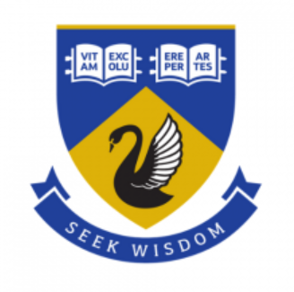
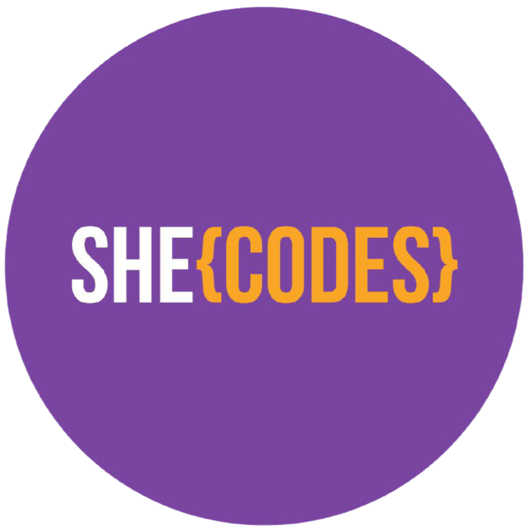

<!--  -->

# **Kristy Leigh:**  Junior Developer & Data Science Enthusiast

<!-- https://github.com/tandpfun/skill-icons#readme -->

 
<i>Tech-stack explored via formal and self-education. 
See <a href="#-current-learning--tech-playgrounds-exploration-revision--challenges"> Playgrounds</a> & <a href="#-my-projects">Projects</a> to understand my proficiency.</i>

---

## ↳ Skip To:

<ul>
  <li style="list-style-type: none;">✨ <a href="https://ms-kl.github.io/">Portfolio Website</a></li>
  <li style="list-style-type: none;">🔗 <a href="https://linktr.ee/kristyleigh"> Business Card / LinkTree </a></li>
   
  <li style="list-style-type: none;">⭐ <a href="#-about-me">About Me</a></li>
  <li style="list-style-type: none;">⚡ <a href="#-career-transition-my-tech-journey">Career Transition: My Tech Journey </a></li>

   
  <li style="list-style-type: none;">📅 <a href="#scheduled-events--training"> Scheduled Events & Training </a></li>
  <li style="list-style-type: none;">🧠 <a href="#-current-learning--tech-playgrounds-exploration-revision--challenges"> Current Learning & Tech Playgrounds:</a>
  </li>
  <li style="list-style-type: none;">🎓 <a href="#-education-training-event--networking-history"> Education, Training, Event & Networking History </a></li>

   

  <li style="list-style-type: none;">💻<a href="#-my-projects"> My Projects:</a></li>
  <li style="list-style-type: none;">🚀 <a href="#-personal-projects-current--wip">Projects: Personal WIP/Current </a> </li>
  <li style="list-style-type: none;">   <a href="#-uwa-post-graduate-certificate-of-commerce-projects">&#160;Projects: UWA GradCertComm </a> </li>
  <li style="list-style-type: none;">   <a href="#-she-codes-plus-projects">&#160;Projects: She Codes Plus </a></li>

   
  <li style="list-style-type: none;">📈 <a href="#-stats">GitHub Stats </a></li>
</ul>

---

## ⭐ About Me:

- I'm a junior developer <b>inspired</b> by AI & Data Science 🤖, <b>excited</b> about game development and <b>fascinated</b> by software engineering 💻.

- As a <b>compliance, audit and documentation nerd</b> 🤓, I bring excellent attention to detail and organisational prowess to every project.

- I'm <b>adaptable, curious, and eager</b> to dive into new technologies, and _[I love attending industry events, workshops and training sessions](#-education-training-event--networking-history)_ to stay up-to-date.

- I'm an _[experienced Trainer, Senior Administrator and Bookkeeper,](https://www.linkedin.com/in/kristyleighgray/)_ and I have also dabbled in retail management, professional cooking 👩‍🍳, and <b>voice-over acting</b> careers. You can often find me immersed in D&D 🧙, swing dancing, or playing pinball.

 

### 🔗 [Get in Touch](https://linktr.ee/kristyleigh)

Looking for Junior Developer or aspiring Data Scientist who's project-driven, _[loves to learn](#-current-learning--scheduled-events)_, gets excited by complex database schemas & AI, and <b>oozes enthusiasm and passion</b>? Let's catch up over coffee ☕, whisky or a game of pinball, and see how my <b>unique skills will add value</b> to your team!

 

↑ [Back to Top](#-skip-to)

---

## ⚡ Career Transition: My Tech Journey

- 🎯 _Career Transition Goal:_  To gain a role in Software Development and/or Data Science in 2023. I achieved this goal in September 2023, gaining my first role as a Junior Software Developer.

- 📜 _Career Background:_ 
  After over 15 years of experience as a Senior Administrator, Trainer, and Bookkeeper, I commenced a career break in July 2022 to focus on transitioning into the tech industry.

- 🎓 _Upskilling & Networking in Tech:_ 
  As part of this learning journey, I am enjoying [participating](#-current-learning--scheduled-events) in relevant courses, developing / contributing to projects and [attending](#-education-training-event--networking-history) workshops and networking events to gain practical knowledge and experience.

 

↑ [Back to Top](#-skip-to)

---

## 📅 Scheduled Events & Training:

🎓 See my [Training & Event History](#-education-training-event--networking-history)

### _Scheduled Events & Training_:

- `07/10/23` [DDD Conference](https://dddperth.com/)

 

↑ [Back to Top](#-skip-to)

---

## 🧠 Current Learning & Tech Playgrounds:  _Exploration, Revision & Challenges_

_See [My Projects](#-my-projects) for in-depth exploration & revision of my learning._

### _Challenges:_

### _Tech Playgrounds:_

-  [C# Playground](https://github.com/Ms-KL/csharp-playground)
-  [LLM OpenAI API Playground](https://github.com/Ms-KL/llm-openai-api-playground)
-  [Python Data Science Playground](https://github.com/Ms-KL/python-data-science-playground)
-  [Streamlit Playground](https://github.com/Ms-KL/streamlit-playground)
-  [Restful API Playground](https://github.com/Ms-KL/restfulapi-playground)
-  [Python Mentor Prep: She Codes One Day Workshop](https://github.com/Ms-KL/python-shecodes-workshop-mentor-prep)
-  [PHP Playground](https://github.com/Ms-KL/php-playground)
-  [SQL Playground](https://github.com/Ms-KL/sql-playground)
-  [Unity C# Playground](https://github.com/Ms-KL/unity-csharp-playground)

### _External Learning:_

- ["Object Oriented Design" (LinkedIn)](https://www.linkedin.com/learning/programming-foundations-object-oriented-design-3)
- ["Learning Git and GitHub" (LinkedIn)](https://www.linkedin.com/learning/learning-git-and-github-14213624/)
- ["AWS Cloud Quest" (AWS)](https://cloudquest.skillbuilder.aws/?refresh=true)
- ["Being Agile" (Udemy)](https://www.udemy.com/share/10769E3@nMGKDQnmsActrYd3pCVHhxT7OP3xTI9PS1GuuZlvl1LFsk8nRKjaHC-mdwV2juvy/)
- ["Agile Foundations" (LinkedIn)](https://www.linkedin.com/learning/agile-foundations)

↑ [Back to Top](#-skip-to)

---

## 💻 My Projects:

###  She Codes Plus Projects:

⚠️ Portfolio v1 = [legacy](https://ms-kl.github.io/v1) 
_Created for She Codes Plus project #1_
 

✨ Portfolio v2 = [current](https://ms-kl.github.io) 
_Redesigned and includes breakdown of projects, video tours and more!_

|       | Tech                             | Project                                                                                          | Code                                                                                 |
| :---- | :------------------------------- | :----------------------------------------------------------------------------------------------- | :----------------------------------------------------------------------------------- |
| ✅'22 | `HTML` `CSS`                     | [Portfolio Website v1 ⚠️ (legacy)](https://ms-kl.github.io/v1)                                   | [Repo](https://github.com/Ms-KL/Ms-KL.github.io/tree/main/v1)                        |
| ✅'22 | `Python`                         | Weather Data Processing                                                                          | [Repo](https://github.com/Ms-KL/she-codes-python-weather-project-Ms-KL)              |
| ✅'22 | `Python` `Django`                | [News Website](https://www.loom.com/share/fa6a7813a17f41b69c7a54d8ddf87a7a)                      | [Repo](https://github.com/Ms-KL/she-codes-django-news-project-Ms-KL)                 |
| ✅'23 | `Python` `Django REST Framework` | [Crowdfunding App (back-end)](https://icy-dew-540.fly.dev/)                                      | [Repo](https://github.com/Ms-KL/she-codes-crowdfunding-api-project-Ms-KL)            |
| ✅'23 | `HTML` `CSS` `React.JS`          | [Crowdfunding App (front-end)](https://prismatic-phoenix-20010b.netlify.app/)                    | [Repo](https://github.com/Ms-KL/crowdfunding)                                        |
| ✅'23 | `React.JS`                       | To-Do list app                                                                                   | [Repo](https://github.com/Ms-KL/she-codes-react-exercises-Ms-KL/tree/main/todo-list) |
| ✅'23 | `Python` `Django REST Framework` | [Mentor Scheduling Tool (back-end)](https://fully-committed-mentor-scheduling-tool.fly.dev/)     | [Repo](https://github.com/SheCodesAus/fully_committed_group_2023_backend)            |
| ✅'23 | `HTML` `CSS` `React.JS`          | [Mentor Scheduling Tool (front-end)](https://fullycommitted-mentor-scheduling-tool.netlify.app/) | [Repo](https://github.com/SheCodesAus/fully_committed_group_2023_frontend)           |

 

###  UWA (Post) Graduate Certificate of Commerce Projects:

|       | Tech     | Project                                                                                                         | Code                                                | Unit                              |
| :---- | :------- | :-------------------------------------------------------------------------------------------------------------- | :-------------------------------------------------- | :-------------------------------- |
| ✅'21 | `Python` | Aviation Analysis System:  • jupyter notebook  • business report • data visualisations                 | [Repo](https://github.com/Ms-KL/uwa-python-project) | Python Programming for Business   |
| ✅'21 | `Excel`  | Investing in our leaders:  • statistical analysis & prediction • business report • data visualisations | Coming Soon                                         | Data Analysis and Decision Making |

 

### 🚀 Personal Projects: Current & WIP

↑ [Back to Top](#-skip-to)

---

## 🎓 Education, Training, Event & Networking History:

_See my:_  
📅 <a href="#scheduled-events--training"> Scheduled Events & Training </a>  
🧠 <a href="#-current-learning--tech-playgrounds-exploration-revision--challenges"> Current Learning & Tech Playgrounds</a>

### _Relative Education & Certifications_:

- `04/23` She Codes Plus Program 22/23 (HTML, CSS, Javascript, ReactJS, Python, Django, DRF)
- `03/23` [Analytics for All Upskilling](https://github.com/Ms-KL/Ms-KL/files/11217428/Graduation_Certificate.-.Kristy_Gray_129330.pdf) - Tracked X WADSIH
- `09/22` [Azure AI Fundamentals](https://www.credly.com/badges/cf1a19d2-5f6e-49d2-9524-5eb88053f091/public_url) - Microsoft
- `15/12/21` [Graduate Certificate in Commerce](https://user-images.githubusercontent.com/92511648/231627150-ac6555e2-ff70-4065-b046-761b6cb28676.png) - UWA
  - `2021` [Data Analysis and Decision Making](https://handbooks.uwa.edu.au/unitdetails?code=MGMT5504)
  - `2021` [Python Programming for Business](https://handbooks.uwa.edu.au/unitdetails?code=BUSN5101)
  - `2020` [Introductory Financial Accounting](https://handbooks.uwa.edu.au/unitdetails?code=ACCT5432)
  - `2020` [Economics for Business and Policy](https://handbooks.uwa.edu.au/unitdetails?code=ECON5541)

### _Training & Workshops Attended_:

- 2023:
  - `12/08/23` - [Level Her Up: Game Development 101](https://levelherup.com.au/) - Build Workshops (Unity)
  - `29/07/23` [Level Her Up: Game Development 101](https://levelherup.com.au/) - Narrative Design Workshop
  - `14/07/23` [Reconnecting Women to their Worth, their Value and the Workplace](https://events.humanitix.com/stempower) - STEMPower Program w/ WiTWA
  - `12/07/23` [Operating Systems and Development Environments](https://events.humanitix.com/webinar-operating-systems-and-development-environments-with-oliver-lavers-powered-by-she-codes) - w/ Oliver Lavers
  - `06/07/23` [AWS Developer Webinar Series: Harnessing the power of Generative AI](https://pages.awscloud.com/anz-developer-webinar-generative-ai.html?trk=1c8a88f3-1206-4b6d-984e-e75cf60094d3&sc_channel=em) - AWS
  - `17/06/23` She Codes One Day Workshop _✨Volunteer Python Mentor_
  - `14/06/23` [Let's talk about Data Science, AI and ML](https://events.humanitix.com/checkpoint-talk-let-s-talk-about-data-science-ai-and-machine-learning-with-asli-yoruk-and-reece-jocumsen-powered-by-she-codes) - w/ Asli Yoruk & Reese Jocumsen
  - `18/05/23` Microsoft Level Up with GitHub Copilot & Codespaces
  - `13/03/23` Microsoft Azure Open Source Night
  - `04/03/23` Developing in Containers, She Codes Plus Masterclass
  - `24/02/23` [Power BI Fundamentals](https://www.eventbrite.com.au/e/wadsih-insight-upskilling-power-bi-fundamentals-tickets-616861498347) - WADSIH x Insight
  - `20/01/23` A Practical Intro to Cyber Security, SBDC x ECU
  - `16/01/23` "Progress over Perfection" with Bel Lloyd

- 2022:
  - `16/11/22` Reactor Pop-Up Workshop Day, She Codes at Microsoft
  - `22/11/22` Hit the Ground Running: CV’s, LinkedIn, Interviews”, WADSIH x People Bank
  - `05/09/22` Mentoring Event "On the Shoulders of Giants", Microsoft Student Accelerator
  - `25/08/22` [Data Science Fundamentals](https://www.eventbrite.com.au/e/wadsih-insight-upskilling-data-science-fundamentals-tickets-368173485807) - WADSIH x Insight

### _Networking, Conferences & Events Attended_:

- Monthly:
  - Python WA Meetup
- 2023:
  - `02/08/23 - 03/08/23` [Data & AI for Business Conference](https://wadsih.org.au/conference/) - WADSIH _✨Volunteer_
  - `13/06/23` [Data Driven Decisions (D3) Conference - “AI in the Wild”](https://www.uwadatainstitute.org.au/conference) - UWA Data Institute
  - `08/06/23` [AWSome Day Online Conference](https://aws.amazon.com/events/awsome-day/awsome-day-online/) - AWS
  - `07/06/23` [Female Coders Collective (FC2) Meetup](https://www.meetup.com/en-AU/female-coders-collective/)
  - `02/06/23` [Latency Conference 2023](https://www.latencyconf.io/) - Mechanical Rock
  - `22/02/23` [AWS Innovate - Data and AI/ML Edition](https://aws.amazon.com/events/aws-innovate/apj/aiml-data/) - AWS
  - `20/02/23` She Codes Perth Networking Event
  - `09/02/23` STOMC Cyber Security Meetup
- 2022:
  - `08/12/22` [AI Industry Day @ 35th Australasian Joint Conference on AI (AI2022)](https://ajcai2022.org/) - UWA
  - `06/12/22` [West Tech Women 2022](https://www.westtechfest.com.au/event/west-tech-women/) - West Tech Fest 2022
  - `05/12/22` [Cybotics AI Day](https://www.westtechfest.com.au/event/cybotics-ai-day/) - West Tech Fest 2022
  - `21/11/22` She Codes x Robert Walters Networking Event
  - `18/11/22` [WITWA Tech[+] Awards Night](https://www.witwa.org.au/gallery/2022-witwa-tech-awards-night/) - WITWA

 

↑ [Back to Top](#-skip-to)

---

<!-- Planned additions -->

## 📈 Stats:

 

 

### **_Most Used Languages Disclaimer:_**

- The GitHub statistics above do not indicate my skill level or the languages I am most proficient in.
- I have overridden the `ipynb` file type to be counted as `Python` or `C#` (instead of `Jupyter Notebook`).
   

↑ [Back to Top](#-skip-to)

<!--
### **_Most Used Languages Disclaimer:_**

- **Incorrect weighting of Jupyter Notebooks in stats:**  
  The GitHub statistics above may be skewed due to the removal of Jupyter Notebooks. These notebooks are counted as `.ipynb` files, which can result in an incorrect weighting towards this file type and no contributions to Python.

- **Removal of Jupyter Notebooks in stats = Lower Python Stats:** 
  To provide a more accurate representation of my top languages, I have removed all Jupyter Notebooks from the statistics. As a result, the Python stats will appear lower than expected.

  -->
